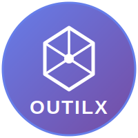

<div align="center">
  
  <h1>Outilx</h1>
  <p><em>A modern, modular utility library collection for JavaScript/TypeScript</em></p>
</div>

Outilx is a monorepo of high-quality, well-tested utility libraries designed to simplify common development tasks across different JavaScript environments.

## 📦 Packages

| Package | Description | Version |
|---------|-------------|---------|
| [@outilx/browser](./packages/browser) | Browser environment utilities |  |
| [@outilx/node](./packages/node) | Node.js environment utilities |  |
| [@outilx/react-hooks](./packages/react-hooks) | React Hooks collection |  |
| [@outilx/ai](./packages/ai) | AI utilities for code detection and streaming |  |

## ✨ Features

- 🎯 **Modular** - Install only what you need
- 📦 **Tree-shakeable** - Optimized bundle sizes
- 🔷 **TypeScript** - Full type definitions included
- ⚡ **Modern** - Built with latest JavaScript features
- 🧪 **Well-tested** - Comprehensive test coverage
- 📚 **Well-documented** - Detailed API documentation

## 🚀 Quick Start

Choose the package that fits your needs:

```bash
# Browser utilities
npm install @outilx/browser

# Node.js utilities
npm install @outilx/node

# React Hooks
npm install @outilx/react-hooks

# AI utilities
npm install @outilx/ai
```

### Usage Examples

```typescript
// @outilx/browser - Array manipulation, caching, JSON utilities
import { toArray, TipCache, parseJsonWithFallback } from '@outilx/browser';

const arr = toArray(1); // [1]
const cache = new TipCache(100);

// @outilx/node - File operations, directory management
import { ensureDirExists, deleteEmptyDirs } from '@outilx/node';

await ensureDirExists('./my-dir');
await deleteEmptyDirs('./my-dir');

// @outilx/react-hooks - State management, async operations
import { useArray, useTaskPendingState } from '@outilx/react-hooks';

function Component() {
  const [items, { push, removeById }] = useArray([]);
  const [load, isPending] = useTaskPendingState(fetchData, setItems);
  // ...
}

// @outilx/ai - Code detection and streaming simulation
import { detectCodeBlocks, useStreamingSimulator } from '@outilx/ai';

const blocks = detectCodeBlocks(markdownText);
const { content, startStreaming } = useStreamingSimulator({ chunks, interval: 100 });
```

## 📚 Documentation

Visit our [documentation site](https://your-docs-url.com) for:
- Detailed API references
- Usage guides and examples
- Best practices
- Migration guides

## 🛠️ Development

```bash
# Install dependencies
pnpm install

# Build all packages
pnpm build

# Run tests
pnpm test

# Run playground (interactive demos)
pnpm playground

# Documentation
pnpm docs:dev      # Start dev server
pnpm docs:build    # Build for production
```

## 📝 Release

This project uses [Changesets](https://github.com/changesets/changesets) for version management:

```bash
# Create a changeset
pnpm changeset

# Dry run (test without publishing)
pnpm release:dry

# Publish stable version
pnpm release

# Publish pre-release versions
pnpm release:alpha
pnpm release:beta
```

## 🏗️ Architecture

Built with modern tools for optimal developer experience:

- **pnpm workspaces** - Efficient package management
- **Turbo** - High-performance build system with smart caching
- **Changesets** - Streamlined version management and publishing
- **tsdown** - Fast TypeScript bundler
- **Vitest** - Lightning-fast unit testing
- **VitePress** - Modern documentation framework

## 🤝 Contributing

We welcome contributions! Whether it's:
- 🐛 Bug reports
- 💡 Feature requests
- 📖 Documentation improvements
- 🔧 Code contributions

Please check our [contributing guidelines](./CONTRIBUTING.md) before submitting.

## 📄 License

MIT © [Your Name]

---

<p align="center">Made with ❤️ by the Outilx team</p>
